# Задания 1:

Дано: Перед вами скриншот страницы карьерного сайта Авито. Изучите его, перечислите все имеющиеся баги, и укажите их приоритет (high, medium, low). Объясните, почему багам присвоены именно они.

---

# Баг-репорт:
***

## **Bug_1:** 
### Название БР: 
Внутри кнопки сброса поиска вместо иконки отображается битое изображение
### Приоритет: 
**medium** (если кнопка кликабельна и ошибка только в отображении, не low потому что сильно бросается в глаза)
### Предусловие: 
1. Открыть страницу https://career.avito.com/vacancies/
### Шаги воспроизведения:
1. Ввести в поле поиска Аналитик
### Ожидаемый результат:
- Появилась кнопка сброса
- Дизайн кнопки сброса поиска серый круг внутри которого черный крестик
### Фактический результат:
- Появилась кнопка сброса
- Дизайн кнопки сброса поиска серый круг внутри которого иконка "сломанное изображение"
### Окружение:
Windows 11 Home, Яндекс браузер Версия 25.12.0.2197 2160x1440
### Дополнительно: 
см. Скрин [Кнопка сброса](#bug_1-кнопка-сброса)
***

## **Bug_2:** 
### Название БР: 
При выборе в поле направления "Data Science" присутствует таб "Поддержка пользователей" из направления Клиентский сервис
### Приоритет: 
**medium** (нарушает логику выдачи по запросу)
### Предусловие: 
1. Открыть страницу https://career.avito.com/vacancies/
### Шаги воспроизведения:
1. В выпадающем списке Направление выбрать Data Science
### Ожидаемый результат:
таб "Поддержка пользователей" отсутствует при выборе направления Data Science
### Фактический результат:
таб "Поддержка пользователей" присутствует при выборе направления Data Science
### Окружение:
Windows 11 Home, Яндекс браузер Версия 25.12.0.2197 2160x1440
### Дополнительно: 
см. Скрин [Доп_таб](#bug_2-доп-таб)
***

## **Bug_3:** 
### Название БР: 
При выборе только направления "Data Science" и запросе "Аналитик" в выдаче присутствуют все направления с упоминанием "аналитик" в названиях вакансий
### Приоритет: 
**high** (нарушает логику выдачи по запросу)
### Предусловие: 
1. Открыть страницу https://career.avito.com/vacancies/
### Шаги воспроизведения:
1. Ввести в поле поиска Аналитик
2. В выпадающем списке Направление выбрать Data Science
### Ожидаемый результат:
- В выдаче отображаются вакансии по запросу аналитик и направлению Data Science
### Фактический результат:
- В выдаче отображаются вакансии из всех направлений содержащее аналитик в названии вакансии или специализации
### Окружение:
Windows 11 Home, Яндекс браузер Версия 25.12.0.2197 2160x1440
### Дополнительно: 
см. Скрин [Доп_направления](#bug_3-доп-направления)
***

## **Bug_4:** 
### Название БР: 
При выборе в поле Город "Санкт-Петербург" в выдаче присутствуют другие города
### Приоритет: 
**high** (нарушает логику выдачи по запросу)
### Предусловие: 
1. Открыть страницу https://career.avito.com/vacancies/
### Шаги воспроизведения:
1. Ввести в поле поиска Аналитик
2. В поле Направление выбрать Data Science
3. В поле Город выбрать Санкт-Петербург
### Ожидаемый результат:
- В выдаче отображаются вакансии только из города Санкт-Петербург
### Фактический результат:
- В выдаче отображаются не только Санкт-Петербург
### Окружение:
Windows 11 Home, Яндекс браузер Версия 25.12.0.2197 2160x1440
### Дополнительно: 
см. Скрин [Города на выдаче](#bug_4-города-на-выдаче)
***

## **Bug_5:** 
### Название БР: 
В выдаче отсутствует город у вакансии "Аналитик данных в бизнес-команду Авито Авто"
### Приоритет:
**medium** (так как скорее всего при регистрации вакансии поле город обязательно для заполнения, на самой странице вакансии скорее всего будет указан город, например, очень длинный город такой что не поместился в сниппет из скрина. High выставил бы только в том случае, если при регистрации вакансии поле Город является необязательным для заполнения. Приоритет тут зависит от того что указано на самой странице вакансии, только по-данному скрину приоритет может быть неточным. Также зависит от самого регламента компании/правил при спорных моментах выставлении приоритета)
### Предусловие: 
1. Открыть страницу https://career.avito.com/vacancies/
### Шаги воспроизведения:
1. Ввести в поле поиска Аналитик
2. В поле Направление выбрать Data Science
3. В поле Город выбрать Санкт-Петербург
### Ожидаемый результат:
- Отображается город у вакансии "Аналитик данных в бизнес-команду Авито Авто"
### Фактический результат:
- Отсутствует город у вакансии "Аналитик данных в бизнес-команду Авито Авто"
### Окружение:
Windows 11 Home, Яндекс браузер Версия 25.12.0.2197 2160x1440
### Дополнительно: 
Приоритет вытекает из серьезности. Если это косметическая проблема — Low. Если проблема с данными — Medium.

см. Скрин [сниппет без города](#bug_5-отсутствует-город)
***

## **Bug_6:** 
### Название БР: 
В поле Команда в выпадающем списке отсутствуют опции/варианты выбора
### Приоритет: 
**high** (влияет на выдачу по запросу)
### Предусловие: 
1. Открыть страницу https://career.avito.com/vacancies/
### Шаги воспроизведения:
1. Ввести в поле поиска Аналитик
2. В поле Направление выбрать Data Science
3. В поле Город выбрать Санкт-Петербург
4. Клик по полю Команда
### Ожидаемый результат:
- В выпадающем списке присутствуют варианты выбора опций
### Фактический результат:
- В выпадающем списке отсутствуют варианты выбора опций, отображается заглушка отсутствия вакансий
### Окружение:
Windows 11 Home, Яндекс браузер Версия 25.12.0.2197 2160x1440
### Дополнительно: 
см. Скрин [поле Команда без опций](#bug_6-поле-команда-без-опций)
***

## **Bug_7:** 
### Название БР: 
При выборе опции "Можно удаленно" в поле формат работы в выдаче отображаются другие опции
### Приоритет: 
**high** (нарушает логику выдачи по запросу)
### Предусловие: 
1. Открыть страницу https://career.avito.com/vacancies/
### Шаги воспроизведения:
1. Ввести в поле поиска Аналитик
2. В поле Направление выбрать Data Science
3. В поле Город выбрать Санкт-Петербург
4. в поле Формат работы выбрать Можно удаленно 
### Ожидаемый результат:
В выдаче вакансии только в формате работы "Можно удаленно"
### Фактический результат:
В выдаче вакансии не только в формате работы "Можно удаленно"
### Окружение:
Windows 11 Home, Яндекс браузер Версия 25.12.0.2197 2160x1440
### Дополнительно: 
см. Скрин [опции формат работы](#bug_7-опции-формат-работы)
***

## **Bug_8:** 
### Название БР: 
В выдаче присутствуют вакансии, не относящиеся к руководящей роли
### Приоритет: 
**high** (нарушает логику выдачи по запросу)
### Предусловие: 
1. Открыть страницу https://career.avito.com/vacancies/
### Шаги воспроизведения:
1. Ввести в поле поиска Аналитик
2. В поле Направление выбрать Data Science
3. В поле Город выбрать Санкт-Петербург
4. в поле Формат работы выбрать Можно удаленно
5. включить чекбокс "Руководящая роль"
### Ожидаемый результат:
В выдаче вакансии только Руководящей роли
### Фактический результат:
В выдаче вакансии не только Руководящей роли
### Окружение:
Windows 11 Home, Яндекс браузер Версия 25.12.0.2197 2160x1440
### Дополнительно:
см. Скрин [Чекбокс Руководящая роль](#bug_8-чекбокс-руководящая-роль)

*Возможно это не считается багом и просто в названии вакансии не передали что это руководящая должность*
***

## **Bug_9:** 
### Название БР:
В сниппете среди городов отображается формат работы
### Приоритет: 
**low** (Скорее всего в поле Город среди выбора опции есть лишняя - "Удалённая работа") 
### Предусловие: 
1. Открыть страницу https://career.avito.com/vacancies/
### Шаги воспроизведения:
1. Ввести в поле поиска Аналитик
2. В поле Направление выбрать Data Science
3. В поле Город выбрать Санкт-Петербург
4. в поле Формат работы выбрать Можно удаленно
5. включить чекбокс "Руководящая роль"
### Ожидаемый результат:
в сниппетах среди городов только города
### Фактический результат:
в сниппетах среди городов формат работы
### Окружение:
Windows 11 Home, Яндекс браузер Версия 25.12.0.2197 2160x1440
### Дополнительно: 
см. Скрин [Формат работы в строке город](#bug_9-формат-работы-в-строке-города)
***

## **Bug_10:** 
### Название БР: 
В выдаче среди вакансий отображается заглушка "Ничего не нашлось. Попробуйте поменять параметры или сбросить фильтры"
### Приоритет: 
**high** (нарушает логику выдачи по запросу)
### Предусловие: 
1. Открыть страницу https://career.avito.com/vacancies/
### Шаги воспроизведения:
1. Ввести в поле поиска Аналитик
2. В поле Направление выбрать Data Science
3. В поле Город выбрать Санкт-Петербург
4. в поле Формат работы выбрать Можно удаленно
5. включить чекбокс "Руководящая роль"
### Ожидаемый результат:
- Если в выдаче содержится хотя бы одна вакансия, заглушка "Ничего не нашлось. Попробуйте поменять параметры или сбросить фильтры" не отображается 
### Фактический результат:
- В выдаче среди вакансий содержится заглушка
### Окружение:
Windows 11 Home, Яндекс браузер Версия 25.12.0.2197 2160x1440
### Дополнительно: 
см. Скрин [Заглушка отсутствия вакансий](#bug_10-заглушка-отсутствия-вакансий)
***

## **Bug_11:** 
### Название БР: 
В выдаче на кнопке "Про направление" отсутствует стрелка в иконке круга
### Приоритет: 
**low** (Не отображается корректно мало заметная иконка кнопки)
### Предусловие: 
1. Открыть страницу https://career.avito.com/vacancies/
### Шаги воспроизведения:
1. Ввести в поле поиска Аналитик
2. В поле Направление выбрать Data Science
3. В поле Город выбрать Санкт-Петербург
4. в поле Формат работы выбрать Можно удаленно
5. включить чекбокс "Руководящая роль"
### Ожидаемый результат:
Иконка внутри кнопки "Про направление" имеет дизайн черный круг внутри которого белая стрелка
### Фактический результат:
Иконка внутри кнопки "Про направление" имеет дизайн черный круг
### Окружение:
Windows 11 Home, Яндекс браузер Версия 25.12.0.2197 2160x1440
### Дополнительно: 
см. Скрин [Иконка в кнопке "Про направление"](#bug_11-иконка-в-кнопке-про-направление)
***

## **Bug_12:** 
### Название БР: 
Выравнивание формата работы в сниппетах 
### Приоритет: 
**low** (не нарушает логику выдачи по запросу)
### Предусловие: 
1. Открыть страницу https://career.avito.com/vacancies/
### Шаги воспроизведения:
1. Ввести в поле поиска Аналитик
2. В поле Направление выбрать Data Science
3. В поле Город выбрать Санкт-Петербург
4. в поле Формат работы выбрать Можно удаленно
5. включить чекбокс "Руководящая роль"
### Ожидаемый результат:
- Внутри сниппета в блоке формат работы текст выравнен по правому краю
### Фактический результат:
- Внутри сниппета в блоке формат работы текст выравнен по левому краю
### Окружение:
Windows 11 Home, Яндекс браузер Версия 25.12.0.2197 2160x1440
### Дополнительно: 
см. Скрин [Выравнивание формата работы](#bug_12-выравнивание-формата-работы)
***

# Приложение:

##### Bug_1. Кнопка сброса:
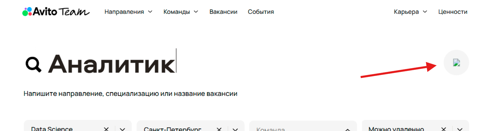

##### Bug_2. Доп таб:
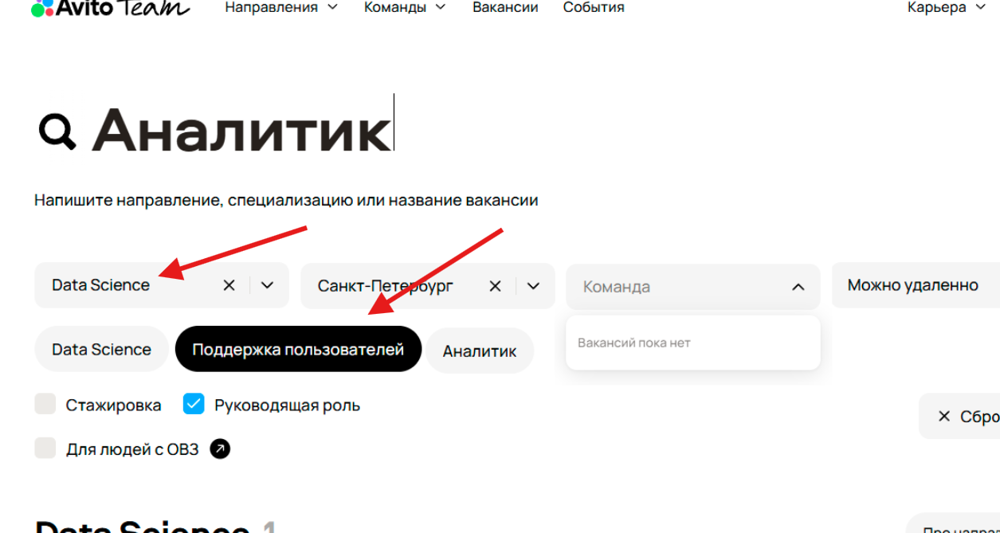

##### Bug_3. Доп направления:
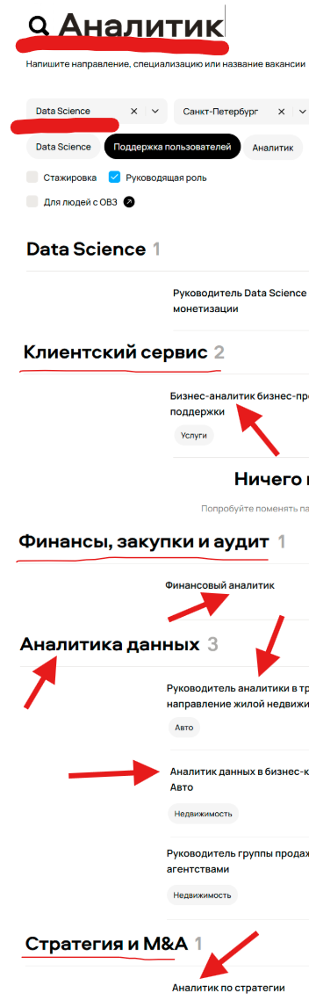

##### Bug_4. Города на выдаче:
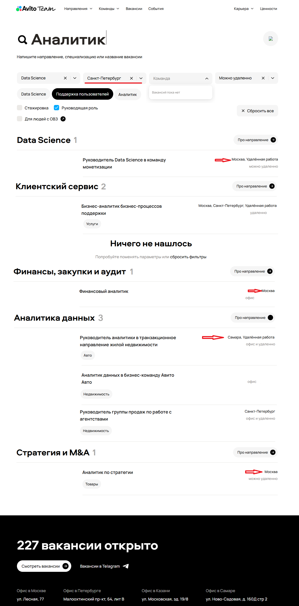

##### Bug_5. Отсутствует город:
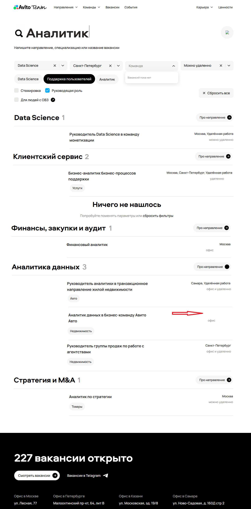

##### Bug_6. Поле Команда без опций:
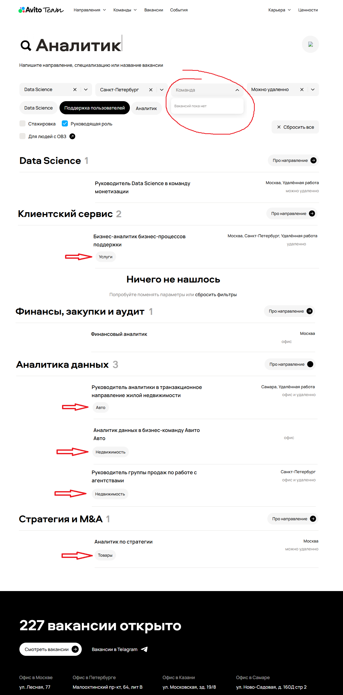

##### Bug_7. Опции формат работы:
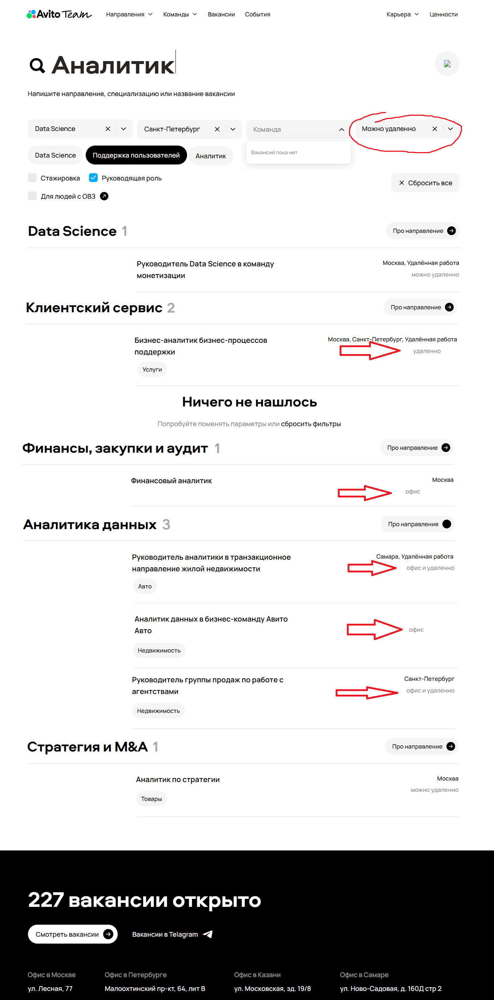

##### Bug_8. Чекбокс Руководящая роль:
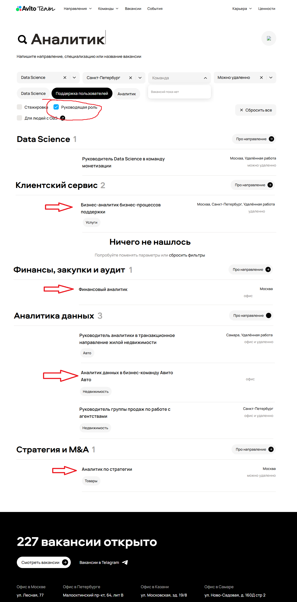

##### Bug_9. Формат работы в строке города:

##### Bug_10. Заглушка отсутствия вакансий:
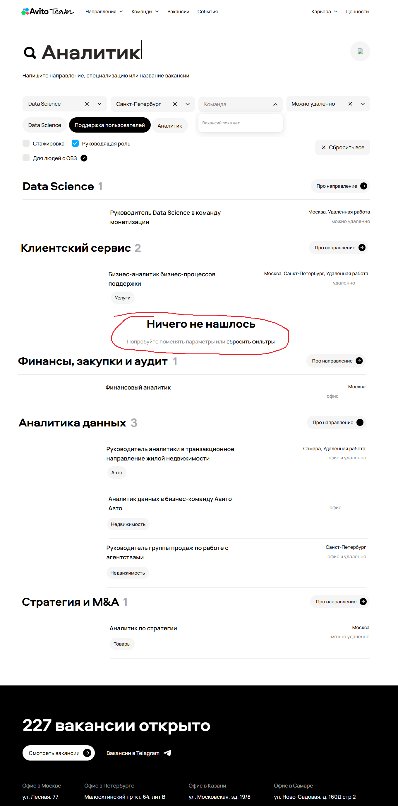

##### Bug_11. Иконка в кнопке "Про направление":
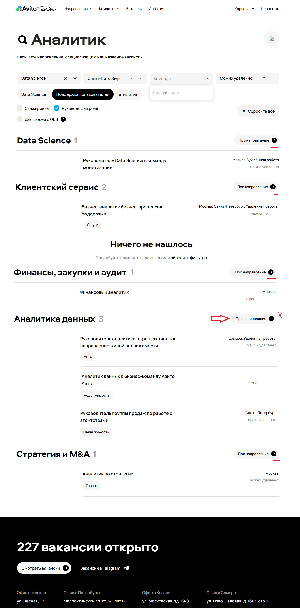

##### Bug_12. Выравнивание формата работы:
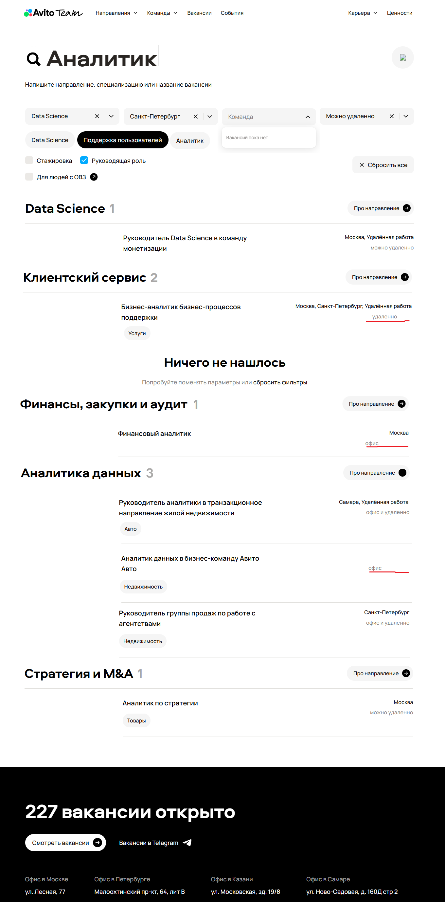
